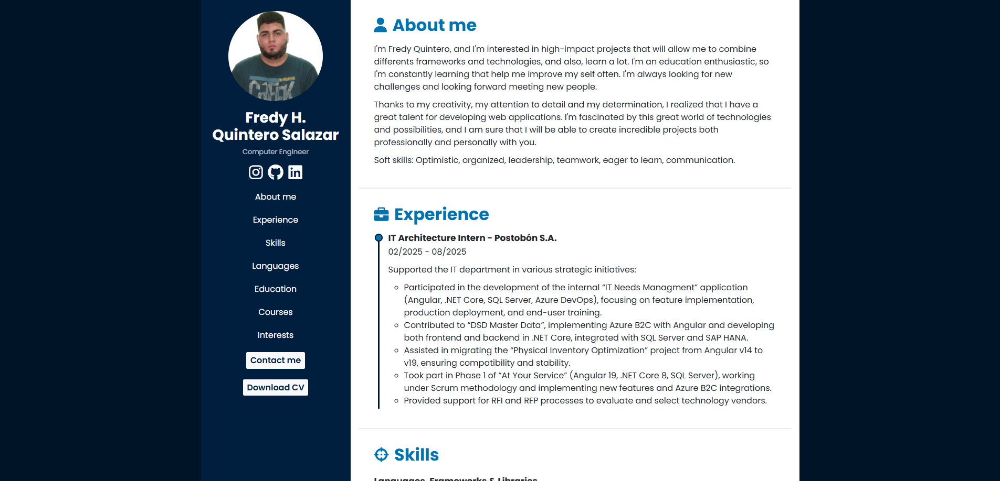

# Curriculum Vitae - Fredy H. Quintero Salazar



## Descripción

Este proyecto es un portafolio y currículum vitae digital desarrollado por Fredy H. Quintero Salazar. Presenta información profesional, experiencia, habilidades, educación, cursos e intereses de manera visual y moderna.

## Tecnologías utilizadas

- HTML5
- CSS3 (custom y Bootstrap 4)
- JavaScript (jQuery)
- Animate.css
- Boxicons
- Font Awesome

## Estructura del proyecto

La organización de carpetas y archivos es la siguiente:

```
├── assets/             # Imágenes de perfil, miniatura, íconos de tecnologías, y otros recursos gráficos.
├── css/
│   └── style.css       # Estilos personalizados para el diseño y responsividad.
├── js/
│   ├── app.js          # Script principal para la interacción del menú y funcionalidades responsivas.
├── index.html          # Página principal del currículum, contiene toda la estructura y contenido.
└── README.md           # Este archivo.
```

Cada sección del currículum (experiencia, habilidades, educación, etc.) está estructurada en el HTML y utiliza recursos de las carpetas mencionadas para una presentación visual atractiva.

## Cómo usar

1. Clona este repositorio:
   ```bash
   git clone https://github.com/Fredy034/Curriculum.git
   ```
2. Abre el archivo `index.html` en tu navegador web favorito.
3. Para desarrollo local con recarga automática, puedes usar la extensión Live Server de VS Code.
